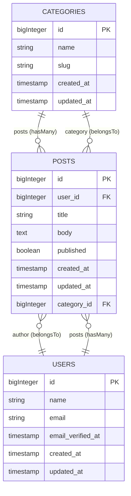

# 🔍 Un(la)ravel

**Statically analyse a Laravel project — without booting Laravel — and un-ravel it into one navigable model, then render that model as diagrams, specs, and reports.**

Un(la)ravel reads a Laravel codebase the way a compiler front-end would: it parses the PHP into an AST, builds a single in-memory **Project Model** of the application, and emits that model as a versioned `unlaravel.json` plus human-friendly views. No database connection. No `vendor/`. No running app. It works on legacy and half-broken projects — exactly the ones you most need to understand.

> Built in Go as a study in real static analysis: AST visitors, a parser-isolation layer, and a clean engine→model→renderer architecture where every output is a thin view over one core.

---

## ✨ What it does today

Point it at a Laravel project and it produces an **Entity-Relationship diagram of your actual data model** — tables and columns from your migrations, *and* the Eloquent relationships from your models — then flags where the two **disagree**.

```console
$ unlaravel analyze ./my-laravel-app --output model.json

✅ Laravel project detected (version: ^11.0)
✅ Extracted 3 table(s) from ./my-laravel-app/database/migrations
✅ Extracted 3 Eloquent model(s)
✅ Wrote analysis to model.json

⚠️  Disagreements (1):
  • Post::editor — foreign key column "editor_id" not found on table "posts"

📊 Entity-Relationship diagram (Mermaid):
  ...
🎉 Analysis complete: 3 table(s), 3 model(s) found
```

### The diagram it generates

The ER diagram is emitted as [Mermaid](https://mermaid.js.org/), so it renders right here on GitHub — and in any Markdown file, Obsidian, or [mermaid.live](https://mermaid.live):



The box-and-column structure comes from your **migrations**. The relationship lines come from your **Eloquent models** (`hasMany`, `belongsTo`, …). When a model relationship points at a table or foreign-key column your migrations never created, that's a **Disagreement** — surfaced as a finding, not hidden. That's the kind of latent bug that's invisible until something breaks in production.

---

## 🚀 Quick start

Requires [Go 1.18+](https://go.dev/dl/).

```bash
# Build the binary
git clone https://github.com/Mawsis/Un-La-ravel.git
cd Un-La-ravel
go build -o unlaravel ./cmd/unlaravel

# Analyze any Laravel project
./unlaravel analyze /path/to/laravel-app

# Also emit the machine-readable model
./unlaravel analyze /path/to/laravel-app --output model.json
```

Don't have a Laravel app handy? Try it on the bundled fixture:

```bash
./unlaravel analyze ./testdata/fixture-app
```

To see the diagram rendered, copy the `erDiagram` block into [mermaid.live](https://mermaid.live) or any GitHub Markdown file.

---

## 🧩 The `unlaravel.json` contract

The engine's real output is a single, versioned JSON document — every other view is a renderer over it. A machine-readable map of any Laravel app:

```json
{
  "schema_version": "1.1.0",
  "project_name": "acme/blog",
  "laravel_version": "^11.0",
  "schemas": [ { "name": "posts", "columns": [ … ] } ],
  "models":  [ { "name": "Post", "table": "posts", "relationships": [
    { "kind": "belongsTo", "method": "author", "target": "User", "foreign_key": "user_id" }
  ] } ],
  "disagreements": [
    { "model": "Post", "relationship": "editor", "kind": "missing_fk_column",
      "reason": "foreign key column \"editor_id\" not found on table \"posts\"" }
  ]
}
```

---

## 🏗️ How it works

One engine builds one model; many renderers view it.

```
Laravel source ──▶ PHP AST ──▶ Extractors ──▶ Project Model ──▶ unlaravel.json
  (read-only)    (VKCOM/      (schema,        (in-memory        (versioned
                 php-parser)   model, …)       graph)            contract)
                                                     │
                                                     ├──▶ Mermaid ER diagram
                                                     ├──▶ (OpenAPI spec — roadmap)
                                                     └──▶ (Markdown report — roadmap)
```

- **Static, never boots Laravel.** A real PHP AST via [`VKCOM/php-parser`](https://github.com/VKCOM/php-parser), isolated behind one package so the parser can be swapped without touching extractors.
- **One Project Model, many renderers.** The hard part is built once; every output is a cheap view. Adding a format is a renderer, not a new engine.
- **No database.** The model lives in memory and serializes to JSON. Single static binary, zero runtime dependencies.

Every architectural decision is recorded as an ADR in [`vault/`](./vault) (an Obsidian vault): the [Architecture Overview](./vault/01%20-%20Architecture/Architecture%20Overview.md), seven [ADRs](./vault/01%20-%20Architecture/ADRs), and a [glossary](./vault/02%20-%20Domain/CONTEXT.md) of the domain language.

---

## 🗺️ Status & roadmap

Un(la)ravel is built in vertical slices — each one takes a node type all the way through the pipeline.

| Node / capability | Status |
|---|---|
| **Schema** (tables/columns from migrations) | ✅ Done |
| **ER diagram** renderer (Mermaid) | ✅ Done |
| **Model** (Eloquent classes + relationships) | ✅ Done |
| **Disagreement** findings (Model ↔ Schema) | ✅ Done |
| `unlaravel.json` versioned contract | ✅ Done |
| **Routes / Controllers / Middleware** + symbol table → dead-route detection | 🔜 Next |
| **FormRequests** → OpenAPI spec renderer | 🔜 Roadmap |
| Markdown architecture report | 🔜 Roadmap |
| Laravel/Composer package (`artisan unlaravel:analyze`) | 🔜 Roadmap |
| N+1 / performance analysis | 🧊 Deferred |

See the full [Roadmap](./vault/04%20-%20Roadmap/Roadmap.md).

---

## 🧪 Development

```bash
go build ./...            # build everything
go test ./... -race       # run the suite (race-clean)
go test ./... -cover      # with coverage
go build -o unlaravel ./cmd/unlaravel
```

The codebase is laid out by responsibility:

```
cmd/unlaravel/      entrypoint
internal/
  detector/         is-this-a-Laravel-project + composer parsing
  phpast/           the only package that imports the PHP parser
  model/            the Project Model + versioned JSON contract
  extract/          one sub-package per node type (schema, model, …)
  render/er/        Project Model → Mermaid ER diagram
  analyze/          Model ↔ Schema correlation (Disagreement findings)
testdata/           a fixture Laravel app + golden outputs
```

---

## 📄 License

MIT — see [LICENSE](./LICENSE).
