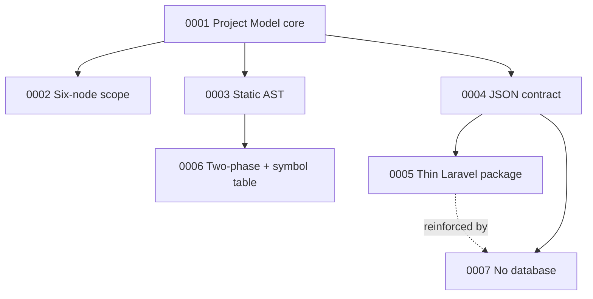

# ADR Index

Architecture Decision Records — *why* the project is shaped the way it is. Each records a decision that is **hard to reverse**, **surprising without context**, and **the result of a real trade-off**. Captured during the grilling session of [[Engineering Journal|2026-06-30]].

| # | Decision | Status | The one-line "why" |
|---|---|---|---|
| [[ADR 0001 - Project Model as the core abstraction\|0001]] | Project Model as the core abstraction | ✅ accepted | One engine + many renderers beats 30 parallel features |
| [[ADR 0002 - Six-node MVP scope\|0002]] | Six-node MVP scope | ✅ accepted | Ship the easy-to-medium nodes; defer the false-positive-prone ones |
| [[ADR 0003 - Static analysis without booting Laravel\|0003]] | Static analysis via PHP AST | ✅ accepted | Real AST (VKCOM/php-parser), never boot Laravel; runs on any project |
| [[ADR 0004 - Serialized Project Model as output contract\|0004]] | `unlaravel.json` is the output contract | ✅ accepted | A versioned JSON seam unlocks the package, testing, and a future web UI |
| [[ADR 0005 - Laravel package is thin wrapper over Go binary\|0005]] | Laravel package = thin wrapper | ✅ accepted | Composer package shells out to the one Go engine; PHP stays minimal |
| [[ADR 0006 - Two-phase extraction with symbol table\|0006]] | Two-phase extraction + symbol table | ✅ accepted | Correct cross-file edges; dangling refs = free dead-route detection |
| [[ADR 0007 - No database in core\|0007]] | No database in the core | ✅ accepted | In-memory graph + JSON; SQLite/GORM is premature infra (overrides brief) |

## How these connect

## Decisions that did NOT get an ADR (and why)

- **Vertical-slice-first build order / Milestone 1 = migrations→ER** — a sequencing choice, easily reversed, not surprising. Lives in [[Roadmap]].
- **Package layout (`cmd/`, `internal/...`)** — standard Go convention, no trade-off. Lives in [[Architecture Overview]].
- **Exact JSON fields, Mermaid syntax, CLI flag names** — implementation details, cheap to reverse. Decided in code.
