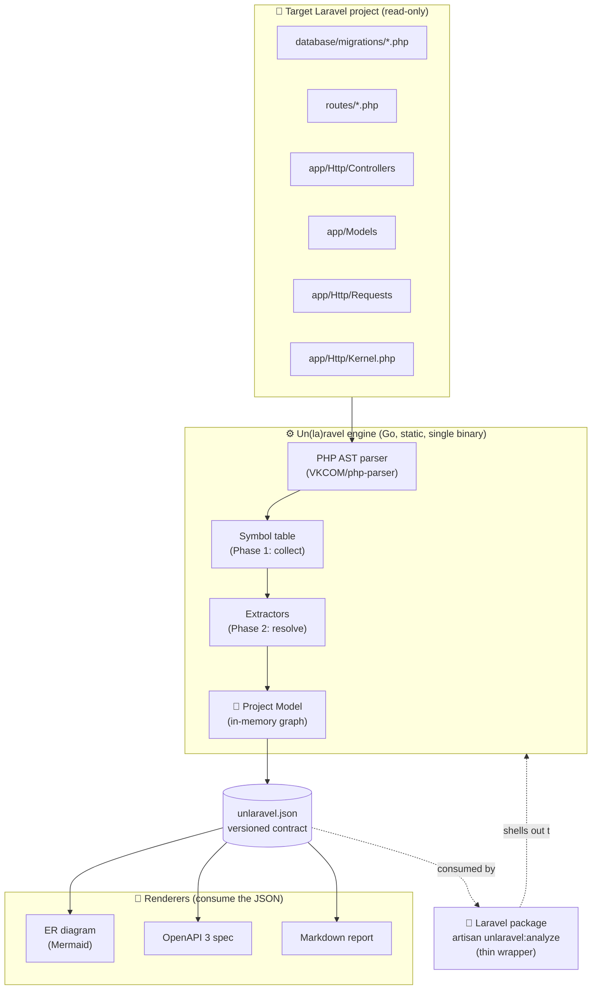
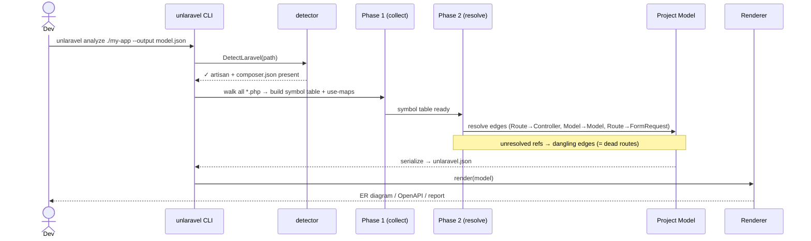
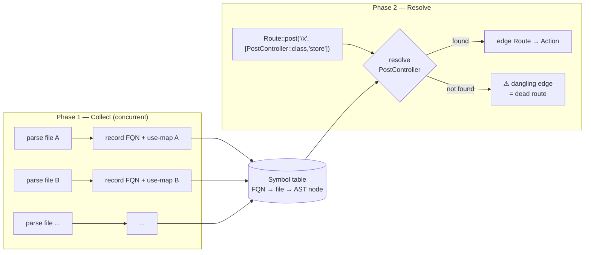

# Architecture Overview

> One engine builds one [[CONTEXT|Project Model]]; many [[CONTEXT|Renderers]] view it. Everything else follows from that.

Decisions behind this design: [[ADR Index]]. Language: [[CONTEXT]]. Sequencing: [[Roadmap]].

## The shape in one diagram (C4 container view)



> [!info] Why this shape
> - The **engine** is the only hard part ([[ADR 0001 - Project Model as the core abstraction|0001]]). Renderers are thin views.
> - It reads files **statically** — never boots Laravel ([[ADR 0003 - Static analysis without booting Laravel|0003]]).
> - `unlaravel.json` is the **public seam** ([[ADR 0004 - Serialized Project Model as output contract|0004]]) — CLI, package, and any future web UI consume it.
> - The package is a **thin wrapper** over the binary ([[ADR 0005 - Laravel package is thin wrapper over Go binary|0005]]).

## How an analysis flows (sequence)



## The two-phase extractor (the hard part)

See [[ADR 0006 - Two-phase extraction with symbol table|ADR 0006]]. Edges cross files, so resolution can't be per-file.



## The six MVP node types

See [[ADR 0002 - Six-node MVP scope|ADR 0002]] and [[CONTEXT]].

| Node | Source | Difficulty | Renderer it unlocks |
|---|---|---|---|
| **Schema** | `database/migrations/*.php` | 🟢 easy | ER diagram |
| **Model** (+rels) | `app/Models/*.php` | 🟡 medium | ER diagram |
| **Route** | `routes/*.php` | 🟡 med-hard (macros) | route map, OpenAPI |
| **Controller/Action** | `app/Http/Controllers` | 🟡 medium | route map, OpenAPI |
| **Middleware** | `Kernel.php` + groups | 🟡 medium | route map |
| **FormRequest** | `app/Http/Requests` | 🟡 medium | OpenAPI request bodies |

Deferred: **Resource** (response shapes) and **Hotspot** (N+1) — need real PHP expression analysis. See [[Roadmap]].

## Target package layout

```
cmd/unlaravel/main.go     entrypoint (MISSING today — Milestone 0)
internal/
  cli/                    cobra commands               (exists)
  detector/               composer + laravel detection (exists, working)
  model/                  Project Model + schemaVersion + JSON
  extract/{schema,model,route,controller,middleware,formrequest}
  render/{er,openapi,report}
testdata/                 fixture app + golden unlaravel.json + golden outputs
```

## Current reality (starting point)

> [!danger] The repo does not build today
> There is **no `cmd/unlaravel/main.go`** and nothing calls `cli.Execute()`. The `analyze` command prints **hardcoded fake `✅` lines** and never calls the (working) `detector`. Fixing this is [[Roadmap|Milestone 0]]. See [[Engineering Journal]] for the full starting-state assessment.
