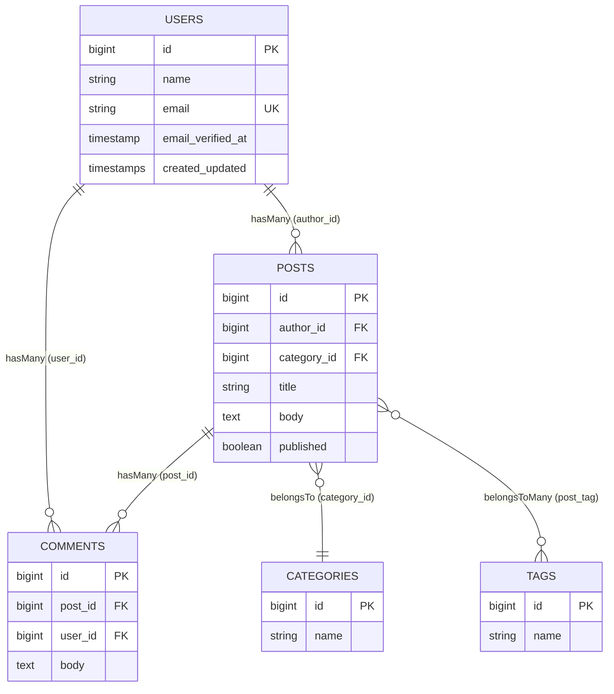
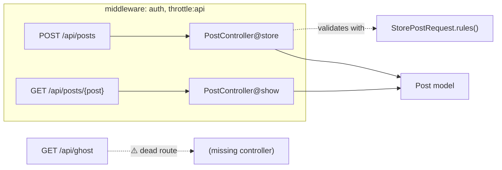

# Diagrams Index

All diagrams are **Mermaid** (renders natively in Obsidian and GitHub — no image files to maintain, version-controllable as text). This matches [[ADR 0004 - Serialized Project Model as output contract|the renderer philosophy]]: the ER renderer itself emits Mermaid.

## Architecture diagrams (live in [[Architecture Overview]])

- **C4 container view** — engine, Project Model, renderers, package
- **Analysis sequence** — request → detect → two-phase → render
- **Two-phase extractor** — symbol table + dangling-edge resolution

## What Milestone 1 will produce (target ER output)

This is the **goal artifact** for [[Roadmap|Milestone 1]] — a Mermaid ER diagram rendered from real `database/migrations/*.php`. Example for a typical blog schema:

> [!note] Two sources, one diagram
> Boxes + columns come from **Schema** (migrations). The relationship lines come from **Model** relationships (`hasMany`/`belongsTo`/`belongsToMany`). Where they disagree (a `belongsTo` with no matching FK column), that's a **finding** to surface, not hide — see [[CONTEXT]].

## What Milestone 3 will produce (route map sketch)

## Conventions

- **Mermaid only.** No `.png`/`.svg` checked in unless a diagram genuinely can't be expressed in Mermaid (then it goes in [[99 - Attachments]]).
- Every diagram in this vault should also be reproducible by a **Renderer** where applicable — the vault and the tool tell the same story.
